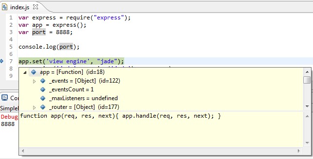
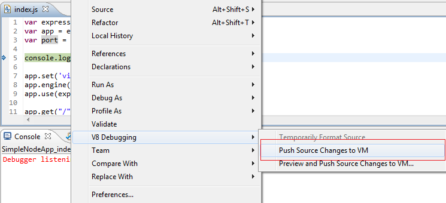

== Introduction
Node.js is the world's fastest growing open source platform with over 3.5 million users and an annual growth rate of 100 percent. It is used for web applications, IoT, mobile, enterprise application development and microservice architectures. With the creation of the https://nodejs.org/en/foundation/[Node.js Foundation] and adoption amongst several companies the future of the platform is bright and clear. This is exactly why adding Node.js support to `JSDT` is the next obvious step.

== Pre-requirements

The following software must be pre-installed:

* https://nodejs.org/en/[Node.js]
* https://www.npmjs.com/[npm]

TIP: Installation instructions for *Node.js* and *npm* can be found https://docs.npmjs.com/getting-started/installing-node[here].

== Node.js runtime definition
By default, the Node.js launch configuration will try to use the system-wide Node.js installation which is automatically identified on workbench startup.

However, it is also posible to define customized Node.js binary paths, switch the Node.js used by default to run or debug applications and fully control the Node.js runtimes available in the workspace. To do that, navigate to *Eclipse Preferences -> JavaScript -> Runtimes*, where the following dialog will appear:

image::Node.js_Runtime_Preferences_1.png[Node.js Runtime Preferences Page]

The identified global Node.js (if there is one) will be listed there, however you can use the buttons on the right side to work with runtimes as follow:

* *Add*: Provide the definition of a new Node.js installation.
* *Edit*: Modify an existing Node.js runtime definition. For non-user defined runtimes this will show the runtime settings in read-only mode.
* *Duplicate*: Create a copy of an existing definition of a Node.js runtime. This is specially useful if you want to run the same installation with different runtime arguments.
* *Remove*: Delete an existing runtime definition. Only available for user-defined Node.js runtimes.

When there are multiple Node.js installations defined, it is possible to switch the default one used to run the workbench Node.js applications. This can be achieved by clicking on the checkbox at the left of the desired installation:

image::Node.js_Runtime_Preferences_2.png[Node.js Runtime Preferences Page 2]

NOTE: This change will affect *all* Node.js launch configurations since this is a workbench-wide setting.

== Quick Start Guide
Running and debugging Node.js applications is pretty straightforward. In order to run/debug a Node.js app you need to select *Run -> Run/Debug Configurations…* and double click *Node.js Application”. This will create a new Node.js Application launch configuration where you need to specify a project and a main file to be run/debugged:

image::Node.js_Application-Run_Configurations.png[Node.js Application - Run Configuration]

Optionally in Arguments tab you can specify Node arguments, Application arguments and the working directory from which the Node.js application will be run/debugged:

image::Node.js_Application_(Arguments)-Run_Configurations.png[Node.js Application (Arguments tab) - Run Configuration]

After pressing *Run/Debug* you can see application's output in the Console view and/or debug your app in the Debug perspective.

NOTE: Node.js Application Launch shortcut will be availbale for projects containing a `package.json` file or a *.js* file that is not in `bower_component` or `node_modules` folder. 
To use the shortcut just right click on the Project/JS file -> *Run/Debug As -> Node.js Application*.

image::Node.js_Application_Shortcut.png[Node.js Application Shortcut]

In order to run a task you should simply right-click on it *-> Run As -> Gulp / Grunt Task*

The execution output will be available in the *Console View*:

Here is a short demo https://vimeo.com/165423967[video] covering Node.js debugger functionality:

video::165423967[vimeo, width=640, height=400]

== How to give it a go ?

Node.js tools are available via `Eclipse IDE for Java EE Developers` / `Eclipse IDE for JavaScript and Web Developers` https://eclipse.org/downloads/index-developer.php[developer builds] before the official Neon release.
 

